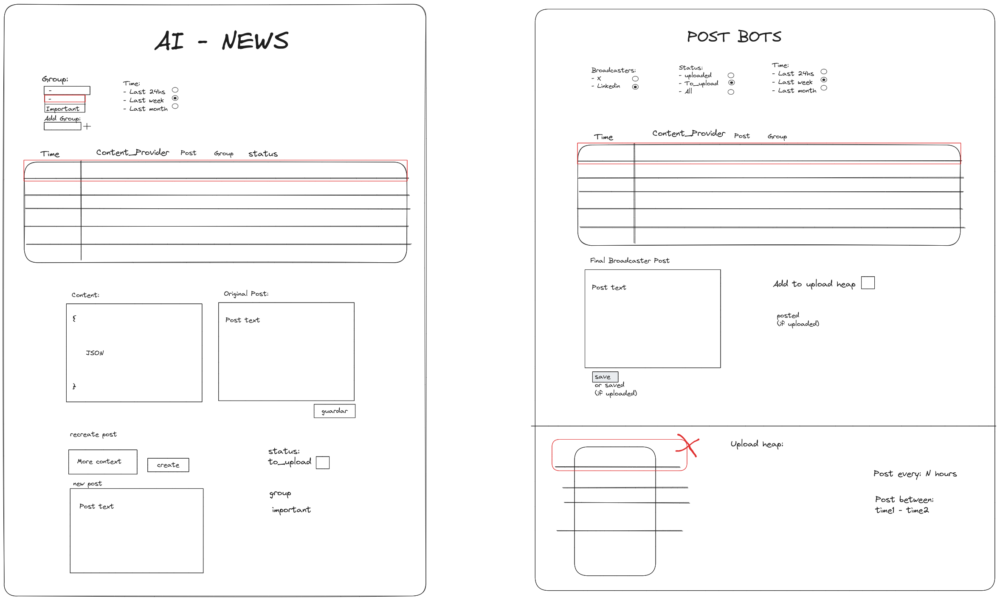
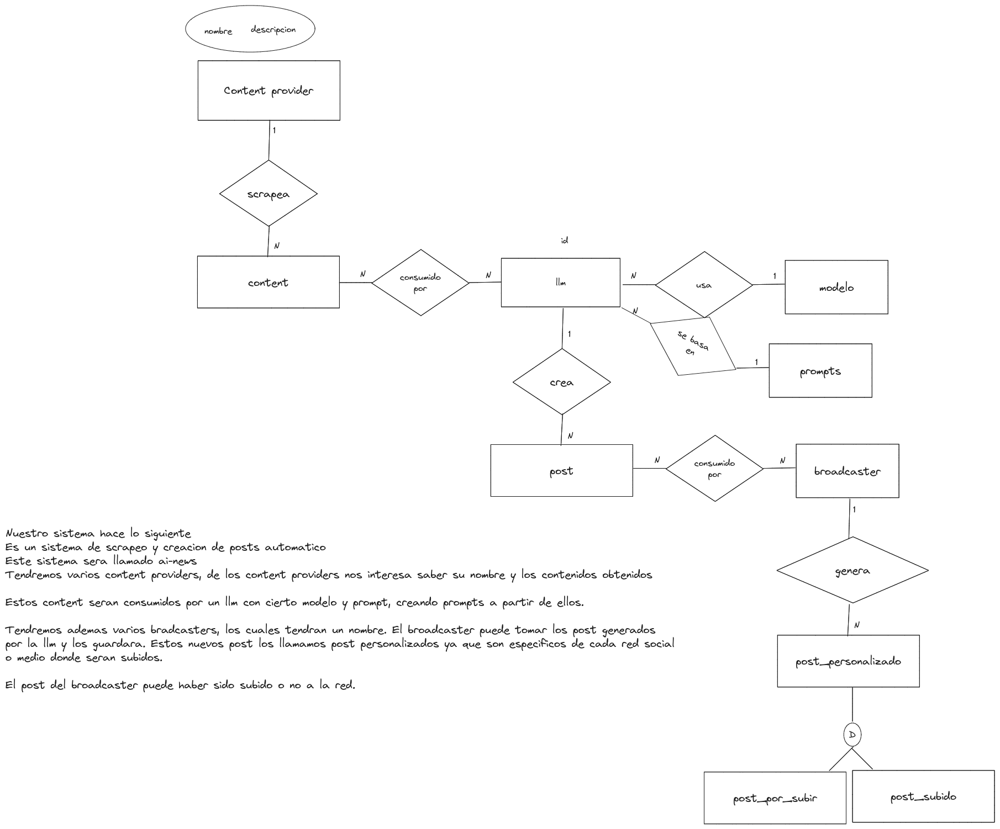

Quiero crear un sistema inspirado en el guru de linkedin-gpt

https://github.com/FrancescoSaverioZuppichini/LinkedInGPT

La llamare ai-news

Hay dos partes fundamenteles:
- el reporter: encargado de obotener informacion de internet y generar textos posts de noticias en español.
Puede tener varios content providers, a los que les preguntara cada tanto cual es la ultima informacion de sus "fuentes"

    - contentPrivider: le dara la informacion al reporter

    - LLM chain
- dataStorage: donde podra guardar la informacion
  
- base de datos: donde guardar los post generados por el reporter.

- el broadcaster: el tomara ciertos posts y se encargara de distribuirlos.

- news-pipeline: conocera a los demas y ayudara

